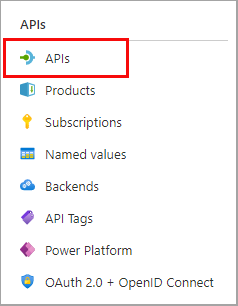

---
lab:
  topic: Azure API Management
  title: Azure API Management로 API 가져오기 및 구성하기
  description: 'OpenAPI 사양을 준수하는 API를 가져오고, 게시하고, 테스트하는 방법을 알아보세요.'
---

# Azure API Management로 API 가져오기 및 구성하기

이 연습에서는 Azure API Management 인스턴스를 생성한 후, OpenAPI 사양을 기반으로 한 백엔드 API를 가져오고, 웹 서비스 URL, 구독 요구 사항을 포함한 API 설정을 구성하며, API 작업을 테스트하여 정상적으로 작동하는지 확인해 보세요.

이 연습에서 수행된 작업:

* Azure APIM(Azure API Management) 인스턴스 만들기
* API 가져오기
* 백 엔드 설정 구성
* API 테스트

이 연습을 완료하는 데 약 **20**분이 걸립니다.

## API Management 인스턴스 만들기

이 연습 섹션에서는 리소스 그룹과 Azure Storage 계정을 만듭니다. 또한 계정에 대한 엔드포인트 및 액세스 키를 기록합니다.

1. 브라우저에서 Azure Portal[https://portal.azure.com](https://portal.azure.com)로 이동한 다음, 메시지가 나타나면 Azure 자격 증명을 사용하여 로그인합니다.

1. 페이지 상단의 검색 창 오른쪽에 있는 **[\>_]** 단추를 사용하여 Azure Portal에서 새 Cloud Shell을 만들고 ***Bash*** 환경을 선택합니다. Cloud Shell은 다음과 같이 Azure Portal 아래쪽 창에 명령줄 인터페이스를 제공합니다. 파일을 보관할 스토리지 계정을 선택하라는 프롬프트가 표시되면 **스토리지 계정 필요 없음**, 구독을 차례로 선택한 다음, **적용**을 선택합니다.

    > **참고**: 이전에 *PowerShell* 환경을 사용하는 Cloud Shell을 만든 경우 ***Bash***로 전환합니다.

1. 이 연습에 필요한 리소스에 대한 리소스 그룹을 만듭니다. **myResourceGroup**을 리소스 그룹에 사용하려는 이름으로 바꾸세요. 필요한 경우, **eastus2**를 근처 지역으로 바꿀 수 있습니다. 사용하려는 리소스 그룹이 이미 있는 경우, 다음 단계를 진행하세요.

    ```azurecli
    az group create --location eastus2 --name myResourceGroup
    ```

1. CLI 명령에 사용할 몇 가지 변수를 만들면 입력해야 할 내용이 줄어듭니다. **myLocation**을 이전에 선택한 값으로 바꾸세요. APIM 이름은 전역적으로 고유한 이름이어야 하며 다음 스크립트는 임의의 문자열을 생성합니다. **myEmail**을 액세스할 수 있는 메일 주소로 바꾸세요.

    ```bash
    myApiName=import-apim-$RANDOM
    myLocation=myLocation
    myEmail=myEmail
    ```

1. APIM 인스턴스를 만듭니다. **az apim create** 명령은 인스턴스를 생성하는 데 사용됩니다. **myResourceGroup**을 이전에 선택한 값으로 바꾸세요.

    ```bash
    az apim create -n $myApiName \
        --location $myLocation \
        --publisher-email $myEmail  \
        --resource-group myResourceGroup \
        --publisher-name Import-API-Exercise \
        --sku-name Consumption 
    ```
    > **참고:** 작업은 5분 이내에 완료해야 합니다. 

## 백 엔드 API 가져오기

이 섹션에서는 OpenAPI 사양 백 엔드 API를 가져오고 게시하는 방법을 보여 줍니다.

1. Azure Portal에서 **API Management Services**를 검색하여 선택합니다.

1. **API Management 서비스** 화면에서 만든 API Management 인스턴스를 선택합니다.

1. **API 관리 서비스** 탐색 창에서 **> API**를 선택한 다음, **API**를 선택합니다.

    


1. **정의에서 만들기** 섹션에서 **OpenAPI**를 선택하고 나타나는 팝업에서 **기본/전체** 토글을 **전체**로 설정합니다.

    

    다음 표의 값을 사용하여 양식을 작성합니다. 언급되지 않은 필드는 기본값을 그대로 둘 수 있습니다.

    | 설정 | 값 | 설명 |
    |--|--|--|
    | **OpenAPI 사양** | `https://bigconference.azurewebsites.net/` | API를 구현하는 서비스를 참조하며, 요청이 이 주소로 전달됩니다. 이 값을 입력하면 양식에 필요한 대부분의 정보가 자동으로 채워집니다. |
    | **URL 구성표** | **HTTPS**를 선택합니다. | API에서 허용하는 HTTP 프로토콜의 보안 수준을 정의합니다. |

1. **만들기**를 실행합니다.

## API 설정 구성

*Big Conference API*가 만들어졌습니다. 이제 API 설정을 구성할 차례입니다. 

1. 메뉴에서 **설정**을 선택하세요.

1. **웹 서비스 URL** 필드에 `https://bigconference.azurewebsites.net/`을 입력합니다.

1. **구독 필요** 확인란을 선택 취소합니다.

1. **저장**을 선택합니다.

## API 테스트

이제 API를 가져오고 구성했으므로 API를 테스트할 시간입니다.

1. 메뉴 모음에서 **테스트**를 선택하세요. 이렇게 하면 API에서 사용할 수 있는 모든 작업이 표시됩니다.

1. **Speakers_Get** 작업을 검색하여 선택합니다. 

1. **보내기**를 선택합니다. HTTP 응답을 보려면 페이지를 아래로 스크롤해야 할 수도 있습니다.

    백 엔드는 **200 정상** 및 일부 데이터로 응답합니다.

## 리소스 정리

연습을 마쳤으므로 불필요한 리소스 사용을 방지하기 위해 만든 클라우드 리소스를 삭제해야 합니다.

1. 만든 리소스 그룹으로 이동하여 이 연습에 사용된 리소스의 내용을 봅니다.
1. 도구 모음에서 **리소스 그룹 삭제**를 선택합니다.
1. 리소스 그룹 이름을 입력하고 삭제할 것인지 확인합니다.

> **주의:** 리소스 그룹을 삭제하면 해당 리소스 그룹에 포함된 모든 리소스가 함께 삭제됩니다. 이 연습을 위해 기존 리소스 그룹을 선택한 경우, 이 연습의 범위와 관계없는 기존 리소스도 삭제됩니다.
